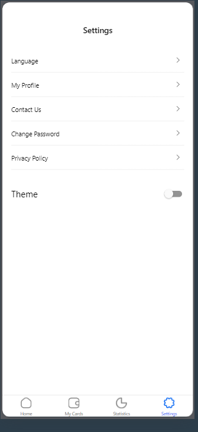
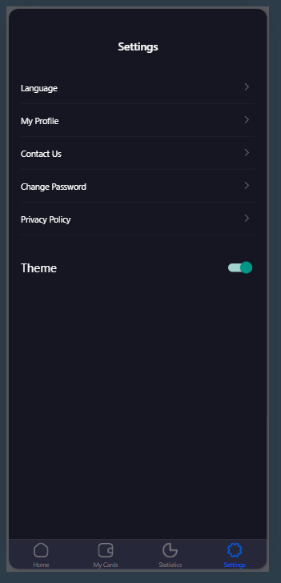

# rn-assignment5-11115682

ID - 11115682
React Native Assignment 5
Job Application Interface
This project is a React Native application designed to mimic a job application interface, featuring a login screen and a home screen that displays job listings. Users can log in by entering their name and email, which will then appear on the home screen along with featured and popular job listings.

Features
Login Screen
Users can input their name and email.
After pressing "Log in", users are taken to the Home Screen with the entered details displayed.
Home Screen
Displays the user's name and email.
Includes a search bar for job searches.
Shows a list of featured and popular job cards.
Screenshots
Home Screen
![Light] (rn-assignment5-11115682/screenshots/Screenshot 2024-06-26 215944.png)
![Dark] (rn-assignment5-11115682/screenshots/Screenshot 2024-06-26 221337.png)

Settings Screen

